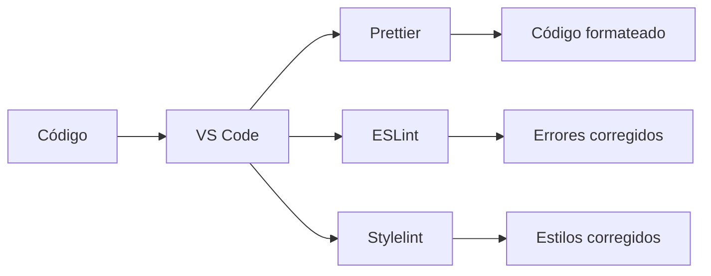
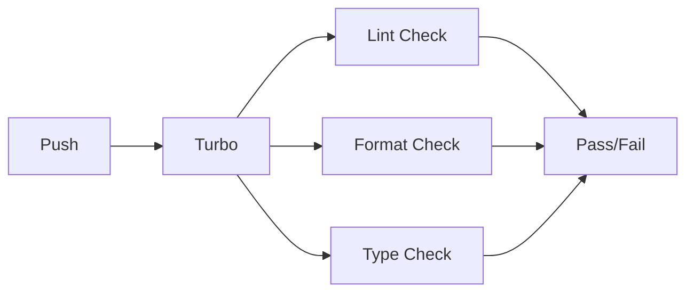

# Sistema de Linters - Proyecto Dutch

## 🎯 Visión General

El sistema de linters del proyecto Dutch es una infraestructura centralizada de herramientas de calidad de código que garantiza consistencia, legibilidad y mantenibilidad en todo el monorepo.

### ¿Por qué usamos linters?

Los linters son herramientas esenciales que nos ayudan a:

- **🔍 Detectar errores temprano**: Encuentran problemas antes de que lleguen a producción
- **📏 Mantener consistencia**: Aseguran que todo el código siga los mismos estándares
- **🚀 Mejorar productividad**: Automatizan tareas de formateo y corrección
- **👥 Facilitar colaboración**: Todos los desarrolladores trabajan con las mismas reglas
- **🛡️ Prevenir bugs**: Identifican patrones problemáticos y anti-patrones
- **📚 Mejorar legibilidad**: Código bien formateado es más fácil de leer y mantener

### 🏗️ Arquitectura del Sistema

Nuestro sistema está diseñado como un **monorepo centralizado** donde:

```
📦 packages/
├── eslint_config/     # Configuraciones ESLint compartidas
├── stylelint_config/  # Configuraciones Stylelint compartidas
└── typescript_config/ # Configuraciones TypeScript

🚀 apps/
├── next/              # Aplicación Next.js
└── astro/             # Aplicación Astro
```

**Beneficios de esta arquitectura:**

- ✅ **Configuración única**: Una sola fuente de verdad para cada linter
- ✅ **Actualizaciones centralizadas**: Cambios se aplican a todo el proyecto
- ✅ **Consistencia garantizada**: Todas las apps usan las mismas reglas
- ✅ **Mantenimiento simplificado**: Menos archivos de configuración que mantener

## 🛠️ Herramientas del Sistema

### 1. **ESLint** - Análisis de JavaScript/TypeScript

- **Propósito**: Detectar errores, aplicar mejores prácticas y mantener consistencia en el código
- **Cobertura**: JavaScript, TypeScript, JSX, TSX, Astro
- **Características**: Reglas estrictas, integración con TypeScript, ordenamiento de imports
- **[Ver documentación detallada](./eslint.md)**

### 2. **Stylelint** - Análisis de CSS/SCSS

- **Propósito**: Mantener consistencia en estilos y detectar problemas en CSS
- **Cobertura**: CSS, SCSS, archivos con Tailwind CSS
- **Características**: Ordenamiento de propiedades, reglas de consistencia, soporte para preprocesadores
- **[Ver documentación detallada](./stylelint.md)**

### 3. **Prettier** - Formateo de código

- **Propósito**: Formatear automáticamente el código para mantener consistencia visual
- **Cobertura**: JavaScript, TypeScript, CSS, SCSS, JSON, Markdown
- **Características**: Formateo automático, integración con editores, configuración consistente
- **[Ver documentación detallada](./prettier.md)**

## 🔄 Flujo de Trabajo

### Desarrollo Local



### Pipeline de CI/CD



## 🚀 Comandos Principales

```bash
# Ejecutar todo el sistema de linters
bun run lint

# Corregir problemas automáticamente
bun run lint:fix

# Linters individuales
bun run eslint          # Solo ESLint
bun run stylelint       # Solo Stylelint
bun run prettier        # Solo Prettier
bun run check-types     # Solo TypeScript
```

## 📊 Versiones Actuales

| Herramienta | Versión | Estado         | Propósito                |
| ----------- | ------- | -------------- | ------------------------ |
| ESLint      | 9.30.0  | ✅ Actualizado | Análisis de código JS/TS |
| Stylelint   | 16.2.1  | ✅ Actualizado | Análisis de estilos      |
| Prettier    | 3.6.2   | ✅ Actualizado | Formateo de código       |
| TypeScript  | 5.8.3   | ✅ Actualizado | Verificación de tipos    |

## 🎯 Beneficios del Sistema

### Para el Proyecto

- **Calidad consistente**: Todo el código sigue los mismos estándares
- **Mantenibilidad**: Código bien estructurado es más fácil de mantener
- **Escalabilidad**: Sistema que crece con el proyecto
- **Integración**: Funciona perfectamente con Turbo y monorepos

### Para el Equipo

- **Productividad**: Menos tiempo en formateo manual
- **Colaboración**: Mismo estándar para todos los desarrolladores
- **Onboarding**: Nuevos desarrolladores se adaptan rápidamente
- **Confianza**: Menos errores en producción

### Para el Código

- **Legibilidad**: Código bien formateado y estructurado
- **Consistencia**: Mismas convenciones en todo el proyecto
- **Robustez**: Detección temprana de problemas
- **Modernidad**: Uso de las mejores prácticas actuales

## 📚 Documentación Detallada

- **[ESLint](./eslint.md)** - Configuración y reglas detalladas
- **[Stylelint](./stylelint.md)** - Configuración y reglas de estilos
- **[Prettier](./prettier.md)** - Configuración de formateo

## 🔧 Integración con Herramientas

### VS Code

- Formateo automático al guardar
- Corrección automática de errores
- Organización automática de imports
- Extensiones recomendadas incluidas

### Turbo

- Caché inteligente para linters
- Ejecución paralela en monorepo
- Integración con CI/CD

### Git Hooks

- Verificación automática en commits
- Prevención de código mal formateado
- Integración con husky (configurable)

## 🎯 Próximos Pasos

1. **Revisar documentación específica** de cada linter
2. **Configurar VS Code** con las extensiones recomendadas
3. **Probar el workflow** de desarrollo local
4. **Familiarizarse** con los comandos principales
5. **Contribuir** a mejorar las configuraciones según necesidades del proyecto
