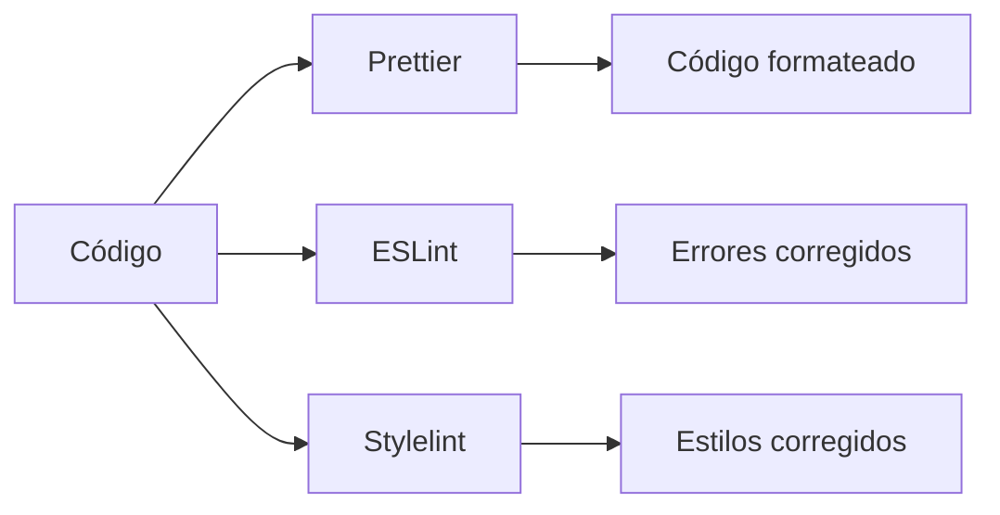
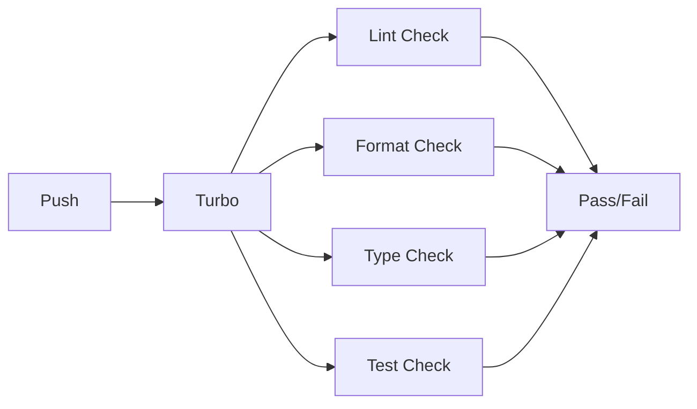

# @repo/config - Sistema de Configuración Centralizada

Sistema centralizado de configuraciones para el monorepo VitaWallet que garantiza consistencia, calidad y mantenibilidad en todo el proyecto.

## 🎯 ¿Qué hace?

Este paquete centraliza todas las configuraciones de herramientas de desarrollo, testing y calidad de código para mantener consistencia en todo el monorepo.

## 🏗️ Arquitectura

```
packages/config/
├── env/           # Variables de entorno
├── eslint/        # Análisis de JavaScript/TypeScript
├── prettier/      # Formateo de código
├── stylelint/     # Análisis de CSS/SCSS
├── typescript/    # Configuraciones TypeScript
└── vitest/        # Configuraciones de testing
```

## 📦 Paquetes Disponibles

### 🔧 [@repo/env](./env/) - Variables de Entorno

Manejo centralizado de variables de entorno con validación Zod y soporte para múltiples entornos.

**Características:**

- Carga automática según `NODE_ENV`
- Validación con Zod
- Soporte para Next.js y Astro
- Configuración por contexto (client/server)

**[📖 Ver documentación](./env/)**

### 🔍 [@repo/eslint](./eslint/) - Análisis de Código

Linter estático para JavaScript/TypeScript con configuraciones específicas por framework.

**Características:**

- Configuraciones para React, Next.js, Astro
- Ordenamiento automático de imports
- Convenciones de nomenclatura
- Detección de errores temprana

**[📖 Ver documentación](./eslint/)**

### 🎨 [@repo/prettier](./prettier/) - Formateo

Formateador de código opinado para mantener estilo consistente.

**Características:**

- Formateo automático
- Configuraciones específicas por framework
- Integración con editores
- Estilo consistente

**[📖 Ver documentación](./prettier/)**

### 🎨 [@repo/stylelint](./stylelint/) - Análisis de Estilos

Linter para CSS/SCSS con ordenamiento y detección de problemas.

**Características:**

- Ordenamiento automático de propiedades
- Detección de propiedades ignoradas
- Soporte para SCSS y Tailwind
- Convenciones de nomenclatura

**[📖 Ver documentación](./stylelint/)**

### 📝 [@repo/typescript](./typescript/) - Configuraciones TypeScript

Configuraciones centralizadas de TypeScript con optimizaciones por framework.

**Características:**

- Configuración estricta por defecto
- Optimizaciones específicas por framework
- Soporte para Next.js, React, Astro
- Mejores prácticas integradas

**[📖 Ver documentación](./typescript/)**

### 🧪 [@repo/vitest](./vitest/) - Testing

Configuraciones de testing con cobertura al 100% y reportes detallados.

**Características:**

- Cobertura de código al 100%
- Reportes en múltiples formatos
- Configuraciones para React y Astro
- Testing de componentes

**[📖 Ver documentación](./vitest/)**

## 🚀 Uso Rápido

### Instalación

```bash
# Las configuraciones ya están disponibles en el monorepo
# No es necesario instalar nada adicional
```

### Configuración Básica

```typescript
// eslint.config.mjs
import { baseConfig } from '@repo/config/eslint';
export default baseConfig;

// vitest.config.ts
import { baseConfig } from '@repo/config/vitest';
export default baseConfig;

// tsconfig.json
{
  "extends": "@repo/config/typescript/base.json"
}
```

## 🔄 Flujo de Trabajo

### Desarrollo Local



### Pipeline de CI/CD



## 🚀 Comandos Principales

```bash
# Ejecutar todo el sistema de calidad
bun run lint
bun run format
bun run check-types
bun run test

# Comandos individuales
bun run eslint          # Solo ESLint
bun run stylelint       # Solo Stylelint
bun run prettier        # Solo Prettier
bun run check-types     # Solo TypeScript
bun run test:coverage   # Solo tests con cobertura
```

## 📊 Versiones Actuales

| Herramienta | Versión | Estado         | Propósito                |
| ----------- | ------- | -------------- | ------------------------ |
| ESLint      | 9.31.0  | ✅ Actualizado | Análisis de código JS/TS |
| Stylelint   | 16.22.0 | ✅ Actualizado | Análisis de estilos      |
| Prettier    | 3.6.2   | ✅ Actualizado | Formateo de código       |
| TypeScript  | 5.8.3   | ✅ Actualizado | Verificación de tipos    |
| Vitest      | 3.2.4   | ✅ Actualizado | Testing y cobertura      |

## 🎯 Beneficios del Sistema

### Para el Proyecto

- **Calidad consistente**: Todo el código sigue los mismos estándares
- **Mantenibilidad**: Código bien estructurado es más fácil de mantener
- **Escalabilidad**: Sistema que crece con el proyecto
- **Integración**: Funciona perfectamente con Turbo y monorepos

### Para el Equipo

- **Productividad**: Menos tiempo en configuración manual
- **Colaboración**: Mismo estándar para todos los desarrolladores
- **Onboarding**: Nuevos desarrolladores se adaptan rápidamente
- **Confianza**: Menos errores en producción

### Para el Código

- **Legibilidad**: Código bien formateado y estructurado
- **Consistencia**: Mismas convenciones en todo el proyecto
- **Robustez**: Detección temprana de problemas
- **Modernidad**: Uso de las mejores prácticas actuales

## 🔧 Integración con Herramientas

### VS Code

- Formateo automático al guardar
- Corrección automática de errores
- Organización automática de imports
- Extensiones recomendadas incluidas

### Turbo

- Caché inteligente para todas las herramientas
- Ejecución paralela en monorepo
- Integración con CI/CD

### Git Hooks

- Verificación automática en commits
- Prevención de código mal formateado
- Integración con husky (configurable)

## 📚 Documentación Detallada

Para información específica de cada herramienta, consulta la documentación individual:

- **[Variables de Entorno](./env/)** - Configuración de entornos
- **[ESLint](./eslint/)** - Análisis de código JavaScript/TypeScript
- **[Prettier](./prettier/)** - Formateo de código
- **[Stylelint](./stylelint/)** - Análisis de estilos CSS/SCSS
- **[TypeScript](./typescript/)** - Configuraciones de tipos
- **[Vitest](./vitest/)** - Testing y cobertura

## 🎯 Próximos Pasos

1. **Revisar documentación específica** de cada herramienta
2. **Configurar VS Code** con las extensiones recomendadas
3. **Probar el workflow** de desarrollo local
4. **Familiarizarse** con los comandos principales
5. **Contribuir** a mejorar las configuraciones según necesidades del proyecto
